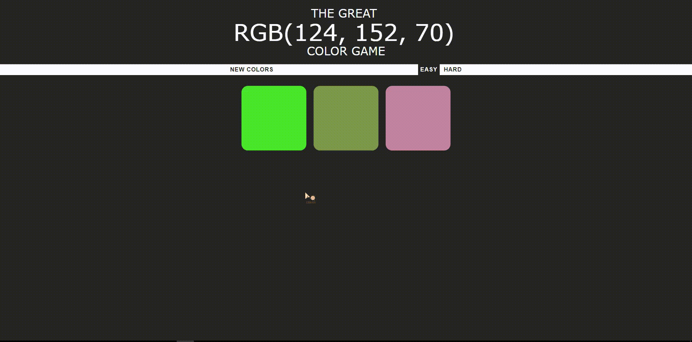
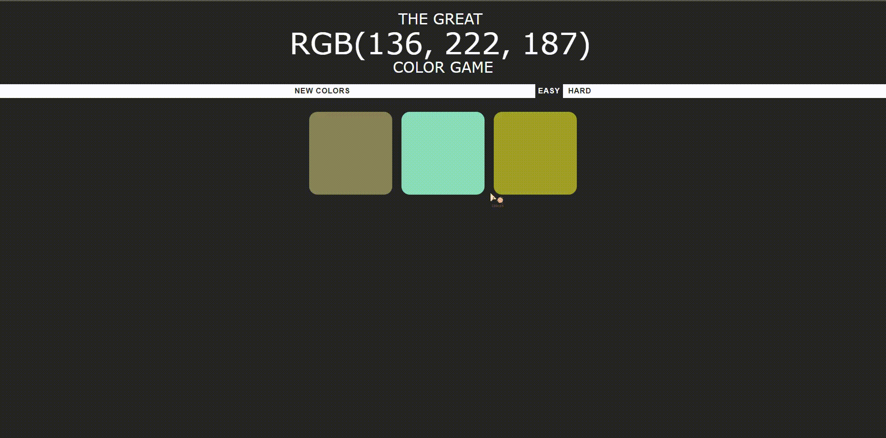

# colorGame

A color game I made while learning javascript.
An RGB value is shown and you have to guess what color it is.
You can see it using this link: https://rabadunk.github.io/colorGame/

# Examples

The point of the game is to look at the randomly generated rgb values at the top and guess the corresponding color. If you get it wrong you can still select another color or click try again to play again.

There is also a hard mode that introduces three more possible colors to add confusion.

